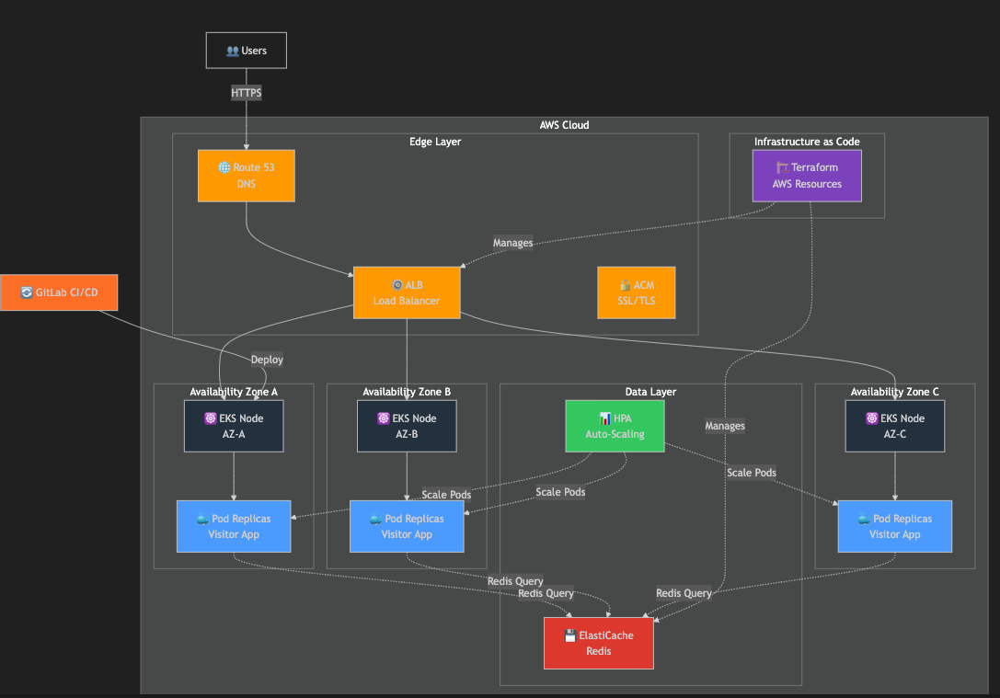

# Cloud Infrastructure Diagram - CDS Visitor Application


## Architecture Overview

The CDS Visitor Application is deployed on **AWS** with a production-grade, highly available, and scalable infrastructure design.

---

## Infrastructure Components

### 1. Edge Layer (Entry Point)

#### Route 53 - DNS Service
```
Function: Domain name resolution and routing
Location: Global (AWS managed service)
Features:
  - Simple DNS routing
  - Health check-based failover
  - Latency-based routing to nearest AZ
```

#### Application Load Balancer (ALB)
```
Function: Distribute incoming traffic across AZs
Location: Multi-AZ
Features:
  - Layer 7 (Application) routing
  - Path-based routing capability
  - SSL/TLS termination
  - Connection draining for graceful shutdown
  - Request/response metrics
```

#### AWS Certificate Manager (ACM)
```
Function: SSL/TLS certificate management
Features:
  - Auto-renewal of certificates
  - HTTPS enforcement
  - Secure communication (in-transit encryption)
```

---

### 2. Compute Layer (Application Servers)

#### Amazon EKS - Kubernetes Service
```
Location: 3 Availability Zones (Multi-AZ)
Regions: ap-southeast-1 (Singapore)

Node Groups:
  - Dev Cluster: 2-3 nodes
  - Prod Cluster: 3-5 nodes
  
Node Types:
  - On-Demand: Guaranteed capacity
  - Spot Instances: Cost optimization
```

#### Kubernetes Pods (Visitor App)
```
Replicas per AZ: Minimum 3 (distributed across AZs)
Container Image: cds-visitor-app:${CI_COMMIT_SHA}

Pod Features:
  - Health checks (liveness + readiness)
  - Resource limits (CPU/Memory)
  - Graceful shutdown (termination grace period)
  - Service discovery via DNS

Deployment Strategy:
  - Rolling updates (maxSurge: 1, maxUnavailable: 0)
  - Zero-downtime deployments
  - Automatic rollback on failure
```

---

### 3. Data Layer (Persistence)

#### Amazon ElastiCache - Redis
```
Service: In-memory caching layer
Cluster Mode: Disabled (single shard, high availability)
Engine: Redis 6.x (latest stable)
Node Type: cache.t3.medium

Features:
  - Automatic failover
  - Multi-AZ deployment
  - Automatic backups
  - Encryption at-rest and in-transit
  - Subnet group for security

Data Stored:
  - Visitor count (integer counter)
  - Session data (if applicable)
```

---

### 4. Auto-Scaling Layer

#### Horizontal Pod Autoscaler (HPA)
```
Target Metric: CPU utilization (70-80%)
Min Replicas: 3
Max Replicas: 10
Scale-up delay: 30 seconds
Scale-down delay: 300 seconds

Scaling Rules:
  - High load: Automatically increase pods
  - Low load: Scale down to save costs
  - Smooth transitions (no abrupt changes)
```

#### EKS Node Auto Scaling Group
```
Min Nodes: 2
Max Nodes: 10
Desired: 3-5 (depends on environment)

Features:
  - Automatic node provisioning
  - Mixed instance types (On-Demand + Spot)
  - Cluster Autoscaler integration
  - Cost optimization via Spot instances
```

---

### 5. Infrastructure as Code (IaC)

#### Terraform Modules
```
Location: /terraform directory
Manages:
  - VPC and networking (subnets, security groups)
  - EKS cluster creation
  - ALB configuration
  - ElastiCache Redis setup
  - IAM roles and policies
  - RDS (if needed)

Benefits:
  - Version-controlled infrastructure
  - Reproducible deployments
  - Easy environment promotion (dev → prod)
  - State management for resource tracking
```

---

## Network Architecture

### Availability Zones (Multi-AZ Deployment)

```
AWS Region: ap-southeast-1 (Singapore)
├── Availability Zone 1 (ap-southeast-1a)
│   ├── Public Subnet (10.0.1.0/24)
│   │   └── ALB (Elastic IPs)
│   └── Private Subnet (10.0.11.0/24)
│       └── EKS Node Group 1 (2-3 nodes)
│           └── Visitor App Pods (replicas)
│
├── Availability Zone 2 (ap-southeast-1b)
│   ├── Public Subnet (10.0.2.0/24)
│   │   └── ALB (Elastic IPs)
│   └── Private Subnet (10.0.12.0/24)
│       └── EKS Node Group 2 (2-3 nodes)
│           └── Visitor App Pods (replicas)
│
└── Availability Zone 3 (ap-southeast-1c)
    ├── Public Subnet (10.0.3.0/24)
    │   └── ALB (Elastic IPs)
    └── Private Subnet (10.0.13.0/24)
        └── EKS Node Group 3 (2-3 nodes)
            └── Visitor App Pods (replicas)
```

---

## Data Flow

### Request Path (User → Application)
```
1. User requests: https://cds-visitor-app.example.com
2. Route 53 resolves DNS → ALB IP
3. ALB receives request (Layer 7)
4. ALB routes to pod in any AZ (round-robin or least connections)
5. Pod processes request
6. Pod queries Redis for visitor count
7. Redis returns count
8. Pod increments counter
9. Pod updates Redis
10. Pod returns updated count to user
11. Response travels back through ALB
12. User receives JSON response
```

### Redis Connection
```
Pod → Private DNS (redis.cds-visitor-app.svc.cluster.local)
→ Kubernetes DNS → ElastiCache Redis endpoint
→ Redis retrieves/updates data
→ Returns result to pod
```

---

## Security Architecture

### Network Security
```
✓ VPC Isolation
  - Private subnets for worker nodes
  - No direct internet access from pods
  - NAT Gateway for outbound traffic

✓ Security Groups
  - ALB: Allows ports 80/443 from internet
  - Nodes: Allows traffic only from ALB
  - Redis: Allows traffic only from pods

✓ Network Policies
  - Pod-to-pod communication restricted
  - Only necessary ports exposed
```

### Identity & Access
```
✓ IAM Roles for Service Accounts (IRSA)
  - Pods use IAM roles instead of keys
  - Fine-grained permissions per pod
  - Temporary credentials (auto-rotated)

✓ AWS Secrets Manager
  - Store sensitive configuration
  - Auto-rotation of secrets
  - Audit trail of access

✓ TLS/SSL Encryption
  - In-transit: HTTPS via ACM certificates
  - At-rest: ElastiCache encryption enabled
```

---

## High Availability Features

### Fault Tolerance
```
1. Multiple AZ Deployment
   - Pod distributed across 3 AZs
   - If AZ-1 fails → requests route to AZ-2, AZ-3
   - No service interruption

2. Auto-Healing
   - Failed pods automatically restarted
   - Health checks validate pod status
   - Failed nodes replaced automatically

3. Database Failover
   - ElastiCache Multi-AZ
   - Automatic replica promotion
   - No manual intervention needed

4. Load Balancer Redundancy
   - ALB Multi-AZ
   - Targets monitored continuously
   - Unhealthy targets removed automatically
```

### Resilience Patterns
```
✓ Circuit Breaker: Prevent cascading failures
✓ Retry Logic: Automatic retry with backoff
✓ Timeout: Prevent hanging requests
✓ Graceful Degradation: Partial functionality on failure
```

---

## Monitoring & Observability

### Metrics Collection
```
- CloudWatch Metrics (default)
  - CPU, Memory, Network on nodes
  - Pod restart count
  - ALB request count, latency

- Kubernetes Metrics
  - Pod resource usage
  - Node capacity

- Application Metrics (optional)
  - Request latency histogram
  - Error rates
  - Cache hit/miss ratio
```

### Logging
```
- CloudWatch Logs
  - Application logs from pods
  - ALB access logs
  - EKS control plane logs

- Pod Logs
  - stdout captured by Kubernetes
  - Accessible via kubectl logs <pod>
```

### Alerting
```
- High CPU usage → Scale up pods
- High memory usage → Investigate memory leak
- High error rate → Investigate application issues
- Deployment failures → Automatic rollback
```

---

## Cost Optimization

### Strategies Implemented
```
1. Spot Instances
   - 70% cost savings vs On-Demand
   - Mixed with On-Demand for stability
   - Automatic replacement on termination

2. Auto-Scaling
   - Scale down during low traffic (nights/weekends)
   - Right-sizing of resources
   - No over-provisioning

3. Reserved Instances (optional)
   - For guaranteed baseline capacity
   - Further discounts for 1-3 year commitments

4. Efficient Resource Usage
   - Pod resource limits prevent waste
   - HPA ensures right replica count
   - EKS Fargate (serverless option)
```

---

## Disaster Recovery

### Backup Strategy
```
- Terraform state: Backed up to S3
- Database backups: ElastiCache automatic backups
- Configuration: Version controlled in Git
- Container images: Registry with immutable tags
```

### Recovery Procedures
```
RTO (Recovery Time Objective): 15-30 minutes
RPO (Recovery Point Objective): Last backup (~5-10 minutes)

Steps to recover:
1. Re-provision infrastructure using Terraform
2. Restore ElastiCache from backup
3. Deploy application via GitLab CI/CD
4. Validate service health
5. Update DNS to point to new infrastructure
```

---

## Deployment Timeline

```
Day 1: Infrastructure Setup
  - Deploy VPC, subnets, security groups
  - Create EKS cluster
  - Set up ElastiCache

Day 2-3: Application Setup
  - Deploy sample application
  - Configure load balancer
  - Set up CI/CD pipeline

Day 4-5: Testing & Validation
  - Load testing
  - Failover testing
  - Security scanning

Day 6: Production Ready
  - Final checks
  - Monitoring setup
  - Go-live
```

---

## Compliance & Best Practices

✓ **AWS Well-Architected Framework**
- Operational Excellence: Monitoring, logging, runbooks
- Security: Encryption, IAM, network isolation
- Reliability: Multi-AZ, auto-scaling, auto-healing
- Performance Efficiency: Right-sized resources, caching
- Cost Optimization: Spot instances, auto-scaling

✓ **Standards Compliance**
- Encryption in-transit (TLS 1.2+)
- Encryption at-rest (KMS)
- Access controls (IAM policies)
- Audit logging (CloudTrail)

